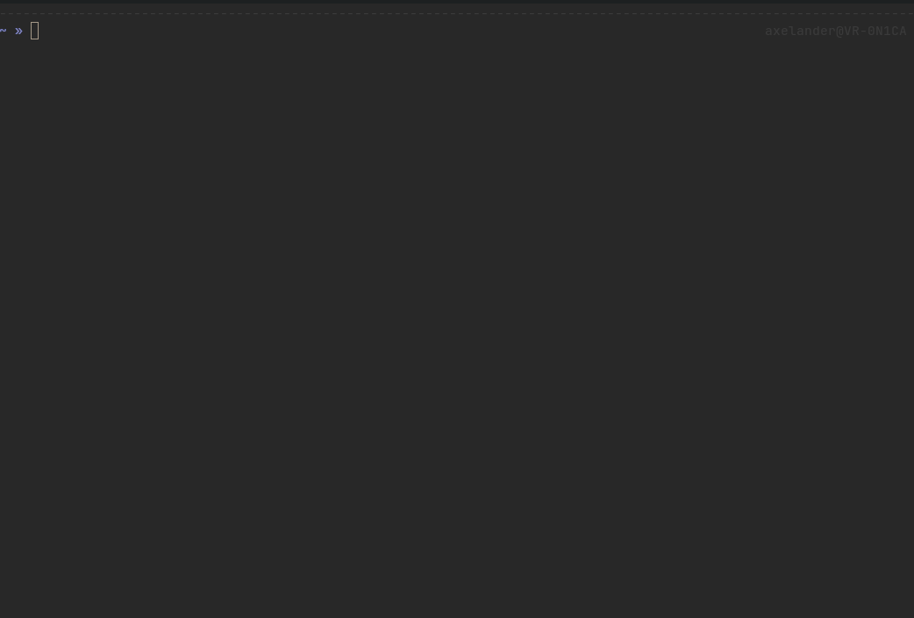

# wtf

**A small helper to display cheatsheets, shortcuts and others inside your terminal.**



## Requirements

- fzf
- config file (see Configuration)

## Installation

Download [latest release](https://github.com/TheAxelander/wtf/releases/latest) and install it via `pipx`

``` bash
apt install python3 python3-pipx
pipx install wtf-x.x.x-py3-none-any.whl
```

Optionally create a venv for development

``` bash
git clone https://github.com/TheAxelander/wtf.git
cd wtf
python3 -m venv venv
source venv/bin/activate
pip install -r requirements.txt
```

## Usage

Without any parameter `fzf` is used to select a file which is then rendered. 

``` bash
wtf

>>> fzf screen is shown
```

Appending a `sheet` (simple file name) renders the file directly without any further selection

``` bash
wtf tmux

>>> tmux file will be displayed
```

## Configuration

See below example config file which is required in `~/.config/wtf/wtf.conf`

``` ini
CHEATSHEET_REPO=/home/axelander/.local/wtf
TABLE_DELIMITER=|
PREVIEW_COMMAND=cat #You could also use wtf itself to render the file inside the fzf preview
```

## Example file

Files need to be written to be compatible with [Rich](https://github.com/Textualize/rich) to render a table like below. The first line will be displayed as header.

```
Command                 |Description
tmux                    |New session
tmux new                |New session
tmux new -s sessionname |New session with name
tmux a                  |Attach session
tmux a -t sessionname   |Attach to named session
[bold cyan]CTRL[/bold cyan] + [bold cyan]B[/bold cyan] [bold yellow]D[/bold yellow]|Detach session
```